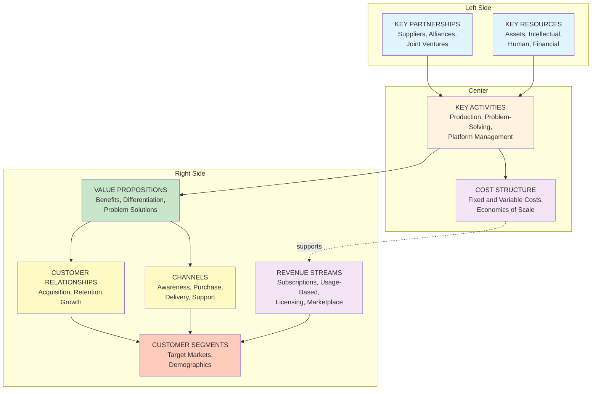
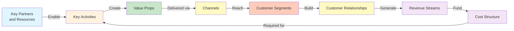
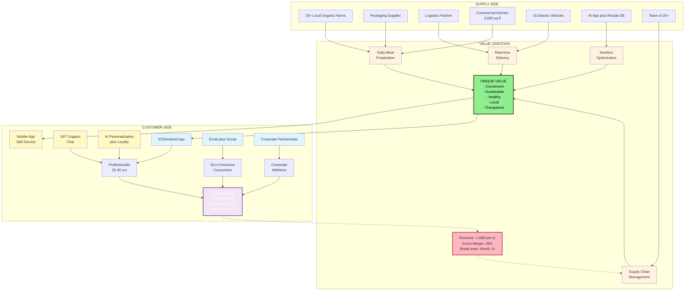

# Business Model Canvas Guide & Template
## Complete Framework with Writing Guidelines

---

## Introduction

The Business Model Canvas is a one-page strategic management template that helps entrepreneurs, innovators, and business leaders develop and refine their business ideas. It provides a visual representation of how a company creates, delivers, and captures value.

This guide provides:
- Detailed writing guidelines for each section
- Practical tips and examples
- Common pitfalls to avoid
- A complete sample business plan

---

## What is a Business Model Canvas?

The Business Model Canvas consists of 9 interconnected building blocks that describe how your business works:



**Visual Flow - How Components Connect:**



---

## The 9 Building Blocks

### 1. CUSTOMER SEGMENTS

**What it is**: The groups of people or organizations you serve with your product/service.

**Writing Guidelines**:
- **Be Specific**: Avoid vague terms like "everyone." Define characteristics clearly.
  - ✅ GOOD: "Health-conscious professionals aged 25-45 in urban areas with household income >$60K"
  - ❌ BAD: "People who want to eat healthy"

- **Use Segmentation Criteria**:
  - Demographic (age, income, gender, location)
  - Psychographic (values, interests, lifestyle)
  - Behavioral (usage patterns, brand loyalty)
  - Geographic (region, city size, climate)
  - Job-based (profession, industry, company size)

- **Prioritize**: List segments in order of importance/revenue potential

- **Validate Market Size**: Ensure segments are large enough to sustain the business

- **B2B vs B2C**: Clearly distinguish between business and consumer segments

**Example**:
```
Customer Segments:
- Health-conscious professionals (25-45 years old) - PRIMARY
- Environmentally aware urban dwellers
- Corporate offices seeking employee wellness programs
- Fitness enthusiasts following specific diets (keto, vegan)
- Time-poor busy professionals in metropolitan areas
```

**Common Mistakes**:
- Too broad ("everyone")
- Unrealistic market size
- Multiple contradictory segments with different needs
- Ignoring willingness to pay

---

### 2. VALUE PROPOSITIONS

**What it is**: The unique benefits and reasons why customers should choose your product over competitors.

**Writing Guidelines**:
- **Focus on Benefits, Not Features**: Describe the outcome, not just what you do.
  - ✅ GOOD: "Save 2 hours per week on meal planning and preparation"
  - ❌ BAD: "Pre-prepared meals delivered to your door"

- **Address Pain Points**: Connect value to specific customer problems.
  - Problems: Time-poor, health-conscious, want sustainability
  - Solutions: Convenient, customizable, eco-friendly

- **Be Specific and Quantifiable**: Use numbers and concrete outcomes.
  - ✅ "Save $5-10 per meal compared to restaurant dining"
  - ❌ "Affordable meals"

- **Differentiation**: Explain why you're different from competitors.
  - What do competitors offer?
  - What's your unique advantage?

- **Emotional & Functional Benefits**: Include both.
  - Functional: "Saves time"
  - Emotional: "Feel good about supporting local farmers"

- **Group by Customer Segment**: Different segments may value different things.

**Example**:
```
Value Propositions:
- Convenience: Pre-prepared, nutritionally balanced meals delivered daily
- Sustainability: 100% compostable packaging, zero-waste operations
- Local Support: 80% ingredients sourced directly from local farms
- Health: Customizable plans (keto, vegan, paleo, low-sodium)
- Transparency: Full ingredient sourcing and nutritional info on app
- Cost Efficiency: 20-30% cheaper than restaurant meals
```

**Common Mistakes**:
- Too many value propositions (focus on 3-5 key ones)
- Vague or generic benefits
- Not backed by feasibility
- Copying competitors without differentiation

---

### 3. CHANNELS

**What it is**: How you communicate with, reach, and deliver to your customer segments.

**Writing Guidelines**:
- **Consider the Full Journey**: Include awareness, purchase, delivery, and support channels.
  - Awareness: How do customers discover you?
  - Consideration: How do they learn more?
  - Purchase: How do they buy?
  - Delivery: How do they receive the product?
  - Support: How do they get help?

- **Match to Customer Segment**: Different segments use different channels.
  - Professionals: LinkedIn, email, mobile app
  - Gen Z: TikTok, Instagram, influencers
  - B2B: Direct sales, industry events, trade shows

- **Direct vs Indirect**: Specify owned vs partner channels.
  - Direct: Your website, app, sales team
  - Indirect: Retailers, distributors, partners

- **Digital & Physical**: Include both online and offline touchpoints.

- **Cost & Effectiveness**: Consider channel economics (ROI, CAC).

**Example**:
```
Channels:
- Mobile app (iOS/Android) - ordering, tracking, account management
- Website - information, subscriptions, educational content
- Social media - Instagram, TikTok (engagement, brand building)
- Corporate partnerships - B2B orders, bulk contracts
- Email marketing - promotions, personalized recommendations
- Retail pop-ups - high-traffic areas, brand awareness
- Chat/WhatsApp support - customer service, real-time help
```

**Common Mistakes**:
- Too many channels (spreads resources thin)
- Ignoring digital-first approach (for most businesses)
- Not integrated (poor customer experience)
- Expensive channels without clear ROI
- Ignoring channels competitors dominate

---

### 4. CUSTOMER RELATIONSHIPS

**What it is**: How you build and maintain relationships with customers to acquire, retain, and grow.

**Writing Guidelines**:
- **Match Your Model**: Relationships should fit your business type.
  - High-touch (luxury): Personal service, dedicated accounts
  - Low-touch (mass market): Self-service, automation
  - Freemium: Community-driven, support when needed

- **Use Relationship Categories**:
  - **Personal Assistance**: Direct, human interaction
  - **Dedicated Support**: Account manager for key customers
  - **Self-Service**: DIY, help documentation, FAQs
  - **Automated Service**: Email, chatbots, automated responses
  - **Community**: Forums, user groups, peer support
  - **Co-creation**: Customers involved in product development

- **Focus on Lifecycle**: Different relationships at different stages.
  - Acquisition: Marketing, sales, onboarding
  - Retention: Support, loyalty programs, engagement
  - Upsell: Recommendations, premium offerings

- **Technology Enablement**: Use tools and software effectively.

**Example**:
```
Customer Relationships:
- Self-service: In-app ordering, tracking, account management
- Automated: Email confirmations, SMS delivery updates, recommendations
- Community: Social media contests, recipe sharing, user forums
- Support: 24/7 chat support, WhatsApp integration, FAQ
- Personalization: AI-driven meal recommendations, preference learning
- Loyalty: Points for referrals, repeat orders, exclusive early access
- Feedback: Regular surveys, beta testing new meals, suggestion box
```

**Common Mistakes**:
- Relationships don't match business model
- Over-personalizing for scale (inefficient)
- Neglecting retention (focus only on new customers)
- No automation for high-volume businesses
- Ignoring community/peer-to-peer opportunities

---

### 5. REVENUE STREAMS

**What it is**: How your business makes money from each customer segment.

**Writing Guidelines**:
- **Multiple Revenue Streams**: Don't rely on one source; diversify where possible.

- **Price Models** (choose what fits):
  - **Subscription/Recurring**: Predictable, stable revenue
  - **Usage-based**: Pay per use, scale-based
  - **Freemium**: Free tier + paid premium features
  - **Fixed Pricing**: Same price for all
  - **Dynamic Pricing**: Price varies by demand, time, etc.
  - **Licensing**: Charge for product use rights
  - **Marketplace**: Take commission on transactions
  - **Advertising**: Revenue from ads on platform

- **Be Specific About Pricing**: Include actual numbers or ranges.
  - ✅ "Subscription: $49/month or $500/year"
  - ❌ "Affordable pricing"

- **Match to Value**: Price should reflect value delivered, not just costs.

- **Different by Segment**: B2B and B2C may have different pricing.

- **Viability Check**: Will revenue exceed costs by healthy margin?

**Example**:
```
Revenue Streams:
- Subscriptions: $65/week (5 meals), $125/bi-weekly (10 meals), $240/monthly (20 meals)
- Pay-per-meal: $14-18 per meal (without subscription)
- Premium Plans: Organic/premium ingredients (+$3-5/meal)
- Corporate Contracts: Bulk orders with 15-20% discount for office delivery
- Partnerships: Commission from local farm promotions, featured brand placement
- Advertising: Premium placement for eco-friendly brands on app
- Referral Revenue: Commission from referred customers in first 3 months
```

**Common Mistakes**:
- Underpricing (not capturing value created)
- Single revenue stream (fragile business)
- Not aligned with value proposition
- Unrealistic pricing for market
- Ignoring payment processing costs

---

### 6. KEY RESOURCES

**What it is**: The assets and inputs required to make your business model work.

**Writing Guidelines**:
- **Categorize Resources**: Organize into types for clarity.
  - **Physical Assets**: Equipment, facilities, vehicles, inventory
  - **Intellectual Property**: Patents, copyrights, trademarks, databases, algorithms
  - **Human Capital**: Team, expertise, relationships, network
  - **Financial**: Funding, credit facilities, cash reserves

- **Only Include What's Critical**: List essentials, not nice-to-haves.

- **Be Specific**: Name actual assets, not vague categories.
  - ✅ "Commercial kitchen, 2,000 sq ft"
  - ❌ "Production facility"

- **Consider Ownership vs Lease**: What do you own vs rent?

- **Dependencies**: Highlight critical dependencies (suppliers, partners, technologies).

- **Competitive Advantage**: What resources do competitors lack?

**Example**:
```
Key Resources:

Physical Assets:
- Commercial kitchen facility (2,000 sq ft)
- Fleet of 15 electric delivery vehicles
- Cold storage infrastructure (2x 5,000 capacity)
- Packaging production line

Technology/Intellectual Property:
- Mobile app (iOS/Android) with real-time tracking
- AI meal recommendation engine
- Recipe database (500+ meals)
- Customer analytics platform
- Supplier management system

Human Capital:
- Founder/CEO (food tech background)
- CTO (app development)
- Executive team (3 people)
- Head Chef + 8 sous chefs/prep cooks
- Logistics Manager (route optimization)
- 25 delivery drivers (contracted)
- Customer support team (5 people)

Financial:
- Initial seed funding: $500,000
- Line of credit: $100,000
```

**Common Mistakes**:
- Underestimating resource needs (causes failure)
- Forgetting hidden costs of ownership
- Not securing critical partnerships upfront
- Listing non-essential resources
- Ignoring talent/skill gaps

---

### 7. KEY ACTIVITIES

**What it is**: The core actions required to operate your business model successfully.

**Writing Guidelines**:
- **Group by Function**: Organize activities logically.
  - Production/Operations
  - Problem-Solving
  - Platform/Network Management
  - Marketing/Sales

- **Link to Value Propositions**: Each activity should support delivering value.

- **Be Specific About What You Do**: Not just the category.
  - ✅ "Daily meal preparation, quality control, nutritional optimization"
  - ❌ "Production"

- **Focus on Core**: What activities are critical to survival?

- **Consider Outsourcing**: Which activities can partners handle?

- **Operational Dependencies**: How do activities depend on each other?

**Example**:
```
Key Activities:

Production & Delivery:
- Daily meal preparation and cooking (6am-3pm)
- Quality control and nutritional verification
- Packaging and labeling
- Route optimization and delivery coordination
- Vehicle maintenance and fleet management

Supply Chain:
- Sourcing from local farms (daily procurement)
- Inventory management and storage
- Supplier relationship management
- Quality verification of ingredients
- Waste management and composting

Technology Development:
- App maintenance and updates
- AI recommendation engine optimization
- Analytics and user behavior tracking
- Payment system management
- Data security and compliance

Marketing & Customer Acquisition:
- Social media content creation (daily)
- Influencer partnerships and promotions
- Email marketing campaigns
- Content marketing (blog, recipes, nutrition tips)
- Corporate partnership development

Customer Service:
- Support ticketing and response (24/7)
- Feedback collection and analysis
- Complaint resolution
- Retention strategies
- Loyalty program management
```

**Common Mistakes**:
- Too many activities (lack of focus)
- Activities not connected to value/strategy
- Underestimating resource requirements
- Forgetting quality control activities
- Not planning for scale-up activities

---

### 8. KEY PARTNERSHIPS

**What it is**: The external organizations and relationships that support your business model.

**Writing Guidelines**:
- **Identify Partnership Types**:
  - **Strategic Alliances**: Non-competitor collaborations
  - **Coopetition**: Partnerships with competitors
  - **Joint Ventures**: Shared ownership ventures
  - **Supplier/Vendor Relationships**: Supply chain partnerships
  - **Customer Partnerships**: Co-creation, distribution

- **Specify Value of Partnership**: What does each partner provide?
  - Cost reduction
  - Resource access
  - Risk reduction
  - Market access
  - Innovation/learning

- **Be Specific About Partners**: Name actual organizations or types.
  - ✅ "Local organic farms in 50-mile radius"
  - ❌ "Suppliers"

- **Mutual Benefit**: Ensure partnerships are mutually advantageous.

- **Scalability**: Can partnerships scale with business?

**Example**:
```
Key Partnerships:

Supply & Production:
- Network of 20+ local organic farms (seasonal produce supply)
- Industrial packaging supplier (compostable containers)
- Restaurant grade equipment suppliers
- Commercial kitchen facility landlord

Operations & Logistics:
- Third-party logistics company (route optimization software)
- Electric vehicle leasing company (fleet maintenance)
- Composting facility network (waste management)
- Cold chain logistics partner (temperature control)

Technology & Finance:
- Cloud infrastructure provider (AWS)
- Payment processor (Stripe)
- SMS/communication platform (Twilio)
- Customer analytics platform

Sales & Marketing:
- Health/fitness influencers (3-5 key partnerships)
- Corporate HR platforms (integration with Workday, BambooHR)
- University wellness programs (bulk contracts)
- Environmental nonprofits (co-marketing)

Distribution:
- Gyms and fitness centers (in-center delivery)
- Corporate campuses (office delivery partnership)
- Whole Foods/natural grocery stores (retail placement)
```

**Common Mistakes**:
- Too many partnerships (complex to manage)
- Partnerships not aligned with strategy
- No backup suppliers (single point of failure)
- Unclear partnership terms/agreements
- Ignoring partnership risks and dependencies

---

### 9. COST STRUCTURE

**What it is**: All costs required to operate your business model.

**Writing Guidelines**:
- **Categorize Costs**: Use accounting categories.
  - **Fixed Costs**: Don't change with volume (rent, salaries)
  - **Variable Costs**: Change with volume (materials, delivery)
  - **Semi-Variable**: Fixed + variable component

- **Be Specific About Amounts**: Include realistic figures.
  - ✅ "$5,000/month rent, $35,000/month salaries"
  - ❌ "Facility and personnel costs"

- **Calculate Cost as % of Revenue**: Helps assess profitability.
  - Food/materials should be 25-35% for most products
  - Marketing typically 10-20%
  - Operations 20-30%

- **Identify Cost Drivers**: What expenses scale with growth?

- **Project at Different Scales**: How do costs change at 100 vs 1,000 customers?

- **Link to Activities & Resources**: Costs come from activities and resources.

- **Comparison to Revenue**: Ensure margins support profitability.

**Example**:
```
Cost Structure:

Fixed Costs (~$60,000/month initially):
- Kitchen facility rent: $5,000/month
- Salaries (executive team + core staff): $35,000/month
  - CEO: $8,000
  - CTO: $6,000
  - Operations Manager: $4,500
  - Head Chef: $4,000
  - 3 sous chefs/prep cooks: $9,000
  - Customer support (3 FTE): $3,500
- Technology & software: $2,000/month
  - Cloud hosting: $800
  - App maintenance: $500
  - Analytics & CRM: $300
  - Payment processing fees: $400
- Marketing & brand: $4,000/month
- Vehicle maintenance & insurance: $3,000/month
- Equipment maintenance: $1,000/month
- Insurance & compliance: $1,500/month
- Miscellaneous: $2,500/month

Variable Costs (~40% of revenue):
- Food cost (ingredients): 30-35% of meal price
  - Average meal price: $14
  - Ingredient cost: ~$4.20 per meal
- Packaging (compostable): 8% of meal price (~$1.12 per meal)
- Delivery cost: $1.50-2.00 per delivery
  - Fuel (electric): ~$0.30 per delivery
  - Driver labor (contracted): ~$1.20 per delivery
  - Vehicle wear: ~$0.30 per delivery
- Payment processing: 2.9% + $0.30 per transaction

Cost Per Meal (Average):
- Food: $4.20
- Packaging: $1.12
- Delivery: $1.80
- Payment fees: $0.44
- Total Variable: $7.56
- Fixed cost allocation: ~$2.50 (at 500 customers)
- Total Cost: ~$10.06 per meal
- Selling Price: $14.00
- Gross Margin: 28%
```

**Common Mistakes**:
- Underestimating costs (fatal to business)
- Forgetting fixed costs when projecting
- Not accounting for taxes, insurance, compliance
- Ignoring cost inflation over time
- Not planning for scale-up costs
- Mixing assumptions (unclear unit economics)

---

## Sample Business Plan: GreenBowl

**Visual Business Model Overview:**



### 1. CUSTOMER SEGMENTS

**Primary Segments**:
- Health-conscious professionals (25-45 years old) - Urban professionals
- Environmentally aware consumers - Eco-conscious demographics
- Busy urbanites - Metropolitan areas with high density

**Secondary Segments**:
- Fitness enthusiasts and diet-focused individuals
- Corporate offices (B2B wellness programs)

**Market Size Validation**:
- Target city: Austin, TX (population 1M+)
- Addressable market: ~15% health-conscious professionals = 150K people
- Target 1% market share Year 1 = 1,500 customers
- Target 5% market share Year 3 = 7,500 customers

---

### 2. VALUE PROPOSITIONS

| Value Prop | Addresses | Quantified Benefit |
|-----------|-----------|------------------|
| **Convenience** | Time-poor professionals | Save 2-3 hours/week on meal planning & prep |
| **Health** | Want nutritional control | Customizable plans (keto, vegan, paleo) |
| **Sustainability** | Environmental concerns | Zero plastic, 100% compostable |
| **Local Support** | Want community impact | 80% local farm sourcing |
| **Transparency** | Health/safety concerns | Full sourcing & nutrition info on app |
| **Cost Efficiency** | Want value | 20-30% cheaper than restaurants |

---

### 3. CHANNELS

| Channel | Stage | Audience |
|---------|-------|----------|
| **Mobile App** | Purchase, Delivery, Support | All segments |
| **Website** | Awareness, Consideration | Desktop users, SEO |
| **Instagram** | Awareness, Engagement | Younger eco-conscious |
| **TikTok** | Awareness, Viral growth | Gen Z health enthusiasts |
| **Email** | Retention, Upsell | Existing customers |
| **Corporate Sales** | B2B acquisition | HR managers, wellness |
| **Retail Pop-ups** | Awareness, Trial | Foot traffic locations |
| **Chat Support** | Support, Retention | Real-time help |

---

### 4. CUSTOMER RELATIONSHIPS

- **Self-Service**: App-based ordering with full control
- **Automated**: Email/SMS order confirmations, delivery notifications
- **Personalized**: AI recommendations based on preferences
- **Community**: Instagram community, recipe sharing, challenges
- **Support**: 24/7 chat, WhatsApp support, FAQ
- **Loyalty**: Points for referrals and repeat orders
- **Feedback**: Monthly surveys, beta testing new meals

---

### 5. REVENUE STREAMS

| Stream | Pricing | Target | Annual |
|--------|---------|--------|--------|
| **Weekly Plans** | $65/week | 200 customers | $676K |
| **Bi-weekly Plans** | $125/2 weeks | 150 customers | $390K |
| **Monthly Plans** | $240/month | 100 customers | $288K |
| **Premium Meals** | +$3-5/meal | 20% of meals | $60K |
| **Corporate Contracts** | Bulk -15% | 5 contracts | $120K |
| **Partnerships** | Commission | 10 partners | $30K |
| **Advertising** | CPM model | 2-3 brands | $20K |
| **TOTAL YEAR 1 PROJECTION** | | 450 avg customers | $1.584M |

---

### 6. KEY RESOURCES

**Physical**:
- Commercial kitchen (2,000 sq ft)
- Electric delivery fleet (15 vehicles)
- Cold storage (capacity for 10K meals)
- Packaging equipment

**Intellectual**:
- Mobile app with AI recommendations
- Recipe database (500+ meals)
- Supply chain management system
- Brand and design assets

**Human**:
- Founder with food tech background
- CTO with startup experience
- Operations manager with logistics background
- Head Chef + kitchen staff (10 people)
- Delivery drivers (25 contracted)
- Customer support (5 people)

**Financial**:
- Seed funding: $500,000
- Line of credit: $100,000

---

### 7. KEY ACTIVITIES

**Daily Operations**:
- Meal preparation (6am-3pm)
- Quality control and packaging
- Route optimization and delivery
- Real-time customer support

**Supply Chain**:
- Daily farm procurement
- Inventory management
- Supplier relationship management
- Waste management

**Technology**:
- App maintenance and feature rollout
- AI algorithm optimization
- Data analytics and reporting
- Security and compliance

**Marketing**:
- Social media content creation
- Influencer partnerships
- Email campaigns
- Corporate partnership development

---

### 8. KEY PARTNERSHIPS

**Supply Chain**:
- 20+ local certified organic farms
- Compostable packaging supplier
- Commercial composting facilities
- Cold chain logistics provider

**Technology**:
- AWS (cloud infrastructure)
- Stripe (payments)
- Twilio (SMS/notifications)
- Analytics platform

**Distribution**:
- 5-10 fitness gyms (in-facility delivery)
- 3-5 corporate offices (bulk contracts)
- Health and fitness influencers (3-5)
- University wellness programs

**Finance**:
- Local bank (credit facility)
- Small business association

---

### 9. COST STRUCTURE

**Fixed Costs (Monthly)**: ~$60,000
- Facility rent: $5,000
- Salaries: $35,000
- Tech/Software: $2,000
- Marketing: $4,000
- Vehicle costs: $3,000
- Insurance: $1,500
- Miscellaneous: $9,500

**Variable Costs (Per Meal)**: ~$7.56
- Ingredients: $4.20 (30%)
- Packaging: $1.12 (8%)
- Delivery: $1.80 (13%)
- Payment fees: $0.44 (3%)

**Unit Economics**:
- Selling Price: $14.00
- Variable Cost: $7.56
- Gross Margin: 46%
- Break-even: ~400 meals/week = $700/week

---

### Financial Projections (Year 1)

| Month | Customers | Revenue | Fixed Costs | Variable | Margin | Cumulative |
|-------|-----------|---------|------------|----------|--------|-----------|
| 1-3 | 50-100 | $7K-14K | $60K | $3.8K-7.5K | -$53K | -$159K |
| 4-6 | 150-200 | $21K-28K | $60K | $11.3K-15K | -$40K | -$279K |
| 7-9 | 250-300 | $35K-42K | $60K | $18.9K-22.7K | -$25K | -$349K |
| 10-12 | 350-450 | $49K-63K | $60K | $26.5K-34K | Break-even to +$3K | -$323K |

**Key Metrics**:
- Year 1 Revenue: $312,000 (estimated)
- Year 1 Burn: ~$323,000
- Break-even: Month 14
- CAC: $45 (marketing + delivery acquisition)
- CLV: $600 (18-month average)
- CLV:CAC Ratio: 13:1 (healthy)
- NPS Target: 50+

---

## Quick Reference Checklist

### Before Writing Your Canvas

- [ ] **Research**: Have you validated customer needs?
- [ ] **Competitive Analysis**: Know your direct and indirect competitors?
- [ ] **Market Size**: Is addressable market large enough?
- [ ] **Feasibility**: Can you execute on this business model?
- [ ] **Team**: Do you have the skills/team needed?

### While Writing Each Section

**Customer Segments**
- [ ] Specific demographics/characteristics defined
- [ ] Market size estimated
- [ ] Primary vs secondary segments identified
- [ ] Differentiated needs per segment understood

**Value Propositions**
- [ ] 3-5 key benefits identified
- [ ] Differentiated from competitors
- [ ] Quantified where possible
- [ ] Addresses real customer pain points

**Channels**
- [ ] Customer journey mapped (awareness → support)
- [ ] Digital and physical touchpoints included
- [ ] Cost and ROI considered
- [ ] Aligned with customer segment behavior

**Customer Relationships**
- [ ] Acquisition strategy defined
- [ ] Retention strategy defined
- [ ] Appropriate level of personalization
- [ ] Technology enablement considered

**Revenue Streams**
- [ ] Multiple streams identified (2-4)
- [ ] Specific pricing included
- [ ] Margins calculated
- [ ] Aligned with value proposition

**Key Resources**
- [ ] Physical assets specified
- [ ] Intellectual property identified
- [ ] Team composition defined
- [ ] Critical dependencies listed

**Key Activities**
- [ ] Linked to value propositions
- [ ] Core vs supporting activities distinguished
- [ ] Scalability considered
- [ ] Resource requirements clear

**Key Partnerships**
- [ ] Suppliers identified
- [ ] Strategic partners named
- [ ] Mutual value articulated
- [ ] Backup partners/risk mitigation planned

**Cost Structure**
- [ ] Fixed and variable costs separated
- [ ] Unit economics calculated
- [ ] Cost as % of revenue assessed
- [ ] Break-even point identified

### Validation Questions

- [ ] Does the business model make financial sense?
- [ ] Are revenue projections achievable?
- [ ] Are there significant resource gaps?
- [ ] Can you execute this with current team?
- [ ] Have you identified key risks?
- [ ] Is customer willingness to pay validated?
- [ ] Can the model scale profitably?

---

## Common Pitfalls & How to Avoid Them

| Pitfall | Why It's Bad | How to Avoid |
|---------|-------------|------------|
| Too many segments | Can't focus marketing | Pick 2-3 primary segments |
| Generic value props | Not differentiated | List specific benefits vs competitors |
| Underpriced | Insufficient margins | Research willingness to pay |
| Too many channels | Resource spread thin | Pick 3 primary channels |
| Unrealistic costs | Profit not achievable | Benchmark against similar businesses |
| Ignoring competition | Miss key dynamics | Research 5+ direct competitors |
| No revenue diversification | Fragile business model | Identify 2-3 revenue streams |
| Unclear partnerships | Execution risk | Name specific partners, not categories |
| No customer validation | Build wrong thing | Talk to 20+ potential customers |
| Ignoring unit economics | Business won't scale | Calculate gross margin, CAC, CLV |

---

## Final Tips

1. **Keep It Visual**: The beauty of the Canvas is it's one page. Use layout and whitespace effectively.

2. **Be Specific**: Vague language indicates fuzzy thinking. Use numbers and names.

3. **Iterate**: This is not a one-time document. Refine as you learn.

4. **Validate Assumptions**: Get out and talk to customers. Don't guess.

5. **Test & Learn**: Build a minimum viable version to test your model.

6. **Focus**: Don't try to do everything. Master one or two channels, segments, or value props first.

7. **Unit Economics Matter**: Know your profit per customer from day one.

8. **Tell a Story**: The Canvas should tell a coherent story about how your business works.

---

## Resources for Further Learning

- **Original Creator**: Alexander Osterwalder (Business Model Generation)
- **Online Tools**: BMC Canvas, Miro, Figma
- **Books**:
  - "Business Model Generation" by Osterwalder & Pigneur
  - "The Lean Startup" by Eric Ries
  - "Value Proposition Design" by Osterwalder, Pigneur, Bernarda, Smith
- **Examples**: View case studies of successful companies' business models

---

**Document created**: March 26, 2026
**Last updated**: March 26, 2026
